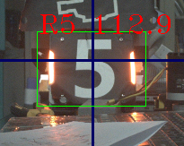
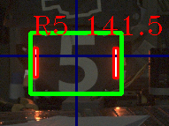

## 关于代码单目测距的误差解释

对于装甲板中心处于相机光轴的情况下，单目测距从原理上是非常准确的，原理是基于相机模型的等比三角测距法，即通过已知装甲板高度，镜头焦距，和图像中计算得出的装甲板矩形框高度。即可求得成像光心与目标中心的距离

已知的三个条件如下：

>1、装甲板高度已知【固定值】
>
>2、镜头焦距【固定值】
>
>3、图像中矩形框大小【变化值】

所以单目测距的准确率与图像中矩形框的高度强相关，图像中的矩形框大小又由一对匹配的灯条强相关。对于大小装甲板而言，装甲板高度是相同的，利用图像中矩形框高度作为测量距离的计算参数。故灯条的大小决定矩形框大小进而决定测量距离。

又因为灯条匹配需要同时兼容大小装甲板的检测，灯条与矩形框的生成关系默认给了一定的裕度。 **若要追求绝对的精度，需要单独对兵种设置好相机参数后，单独针对这套相机参数建立弹道模型【角度与距离的关系】** 

如下图为不同参数对矩形框生成的影响，上图相对下图给了更大的曝光时间，导致矩形框高度不同。进而影响测距结果。

