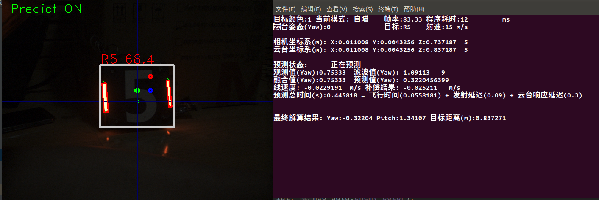

# **思玄战队 RoboMaster 2022 视觉代码**

## 特别致谢：
`上海交通大学`、`桂林电子科技大学`、`华南师范大学`、`广州理工学院`、`沈阳航空航天大学` 等视觉开源项目团队！

以及 RoboMaster 视觉交流群热心网友们的支持！

## 一、项目说明
本代码在 RoboMaster 2022 赛季完成了以下内容。

* 对敌方装甲板进行有效识别。
* 自定义串口通讯协议与下位机进行通讯控制云台运动。
* 对目标的运动进行实时分析，实现预测击打。
* 根据目标深度和弹丸速度对 Pitch 轴进行补偿，实现准确命中。

### 自瞄装甲板识别

## 二、运行示例
1. 环境安装请参阅 [《环境配置手册》](doc/环境配置手册.md)
2. 进入项目目录，然后
~~~ shell
# 构建和编译
mkdir build && cd build
cmake .. && make

# 以可视化模式运行（第一次启动载入模型较慢，需耐心等待）
./run --test-show-armor-predict
~~~

## 三、参考资料
### 1、测试用例

> 运算设备：Intel NUC 11i7
>
> 视觉传感器：海康威视 MV-CA016-10UC 160万全局快门彩色工业相机
>
> 程序输入： 1440 X 1080   网络推理输入: 414 X 414 X 3
>
> 网络推理耗时 10ms

### 2、工作条件

务必保证摄像头焦距正确，同时镜片干净无污物。由于使用了网络识别，务必保证光照充足，装甲板图案清晰可见。

光照不足时，调整摄像头曝光或增益数值，直到图案清晰可见。如有需要可针对实际环境情况调整白平衡。