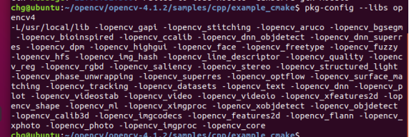
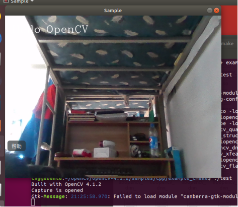

---


---

#                                 Opencv-4.1.2的离线安装

## 一、 解压opencv.zip

   压缩包文件构成：

   > **opencv-4.1.2      核心主库**
   >
   > **opencv_contrib  拓展库**
   >
   > **download            离线资源包**

   

## 二、安装

#### **离线安装的一些准备工作**

将以下位置所标记的内容修改为实际 download.zip 解压的目录 例如  "file:/opt/opencv/download/"
   1.  /opencv-4.1.2/3rdparty/ippicv/ippicv.cmake（第47行）

   2.  /opencv_contrib/modules/xfeature2d/cmake/download_boostdesc.cmake（第27行）

   3.  /opencv_contrib/modules/xfeature2d/cmake/download_vgg.cmake（第21行）
   4.  /opencv_contrib/modules/face/CMakeLists.txt（第19行）

   5.继续修改一个文件位于   /opencv_contrib/modules/xfeatures2d/sr/sift.cpp  打开文件将110行(#include<...tls.hpp>)注释或者直接删除


#### **安装相关环境**

```shell
[编译程序] sudo apt-get install build-essential
[必选] sudo apt-get install cmake git libgtk2.0-dev pkg-config libavcodec-dev libavformat-dev libswscale-dev

（若使用Python则进行选装）
[可选] sudo apt-get install python-dev python-numpy libtbb2 libtbb-dev libjpeg-dev libpng-dev libtiff-dev libjasper-dev libdc1394-22-dev
```

​       若上面的【可选项】报错则执行以下三行命令

```shell
sudo add-apt-repository "deb http://security.ubuntu.com/ubuntuxenial-security main"
sudo apt update
sudo apt install libjasper1 libjasper-dev
```


#### **构建与编译**

打开终端，进入opencv-4.1.2目录下，执行以下命令

1、（创建 build 文件夹并进入）

```shell
mkdir build
cd build
```

2、（cmake 构建）

注意最后一行路径是实际opencv_contrib所在的目录路径！！！

```shell
cmake -D CMAKE_BUILD_TYPE=Release 
-D OPENCV_GENERATE_PKGCONFIG=ON 
-D CMAKE_INSTALL_PREFIX=/usr/local 
-D OPENCV_EXTRA_MODULES_PATH=【实际opencv_contrib所在的目录路径】/modules ..
```

3、(编译与生成)【-j8 是指定了8个核心线程进行编译，按实际情况选择数目即可，核心越多编译越快】

```shell
make -j8
```

4、(安装部署opencv库）【默认存放在上面cmake中编写的 /usr/local 中】

```shell
sudo make install
```


#### **环境变量的配置**

1、打开环境变量文件(使用gedit或vim等文本工具打开均可)

```shell
sudo gedit /etc/ld.so.conf.d/opencv.conf
```

2、添加以下文本并保存

~~~shell
/usr/local/lib
~~~

3、更新环境变量

```shell
sudo ldconfig
```

------


## 三、测试示例

在位于**./opencv-4.1.2/samples/cpp/example_cmake/** 下打开终端执行

```shell
pkg-config --libs opencv4
```

若成功出现以下结果图




若顺利继续测试一个官方示例【若成功则会生成可执行文件(将example.cpp编译生成opencv_example可执行文件，详见CMakeLists.txt))】

插入免驱摄像头(或设备自带摄像头)，在 **./opencv-4.1.2/samples/cpp/example_cmake/** 下打开终端执行


1、cmake构建

```shell
cmake .
```

2、编译与生成

```shell
make
```

3、运行生成文件

```shell
./opencv_example
```

成功后会出现以下画面恭喜！！




## 四、常见问题与解决 (99%问题)

1、注意文件(夹)操作权限，若出现权限不够，可使用以下命令直接开放文件(夹)权限：

> sudo chmod -R 777 文件(夹)名

2、注意路径问题，安装时请明确当前路径和操作路径

3、若编译出现错误，尝试按照报错信息或回顾之前步骤复盘解决。可尝试删除 build 文件夹里内容重新编译。

