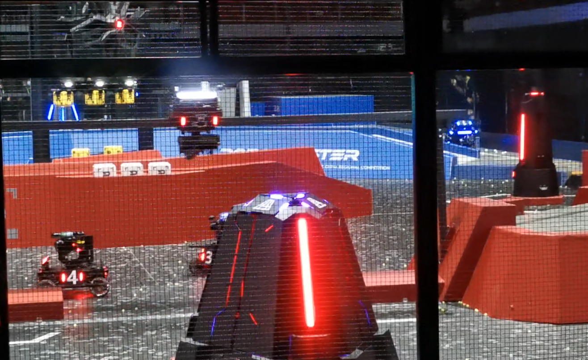
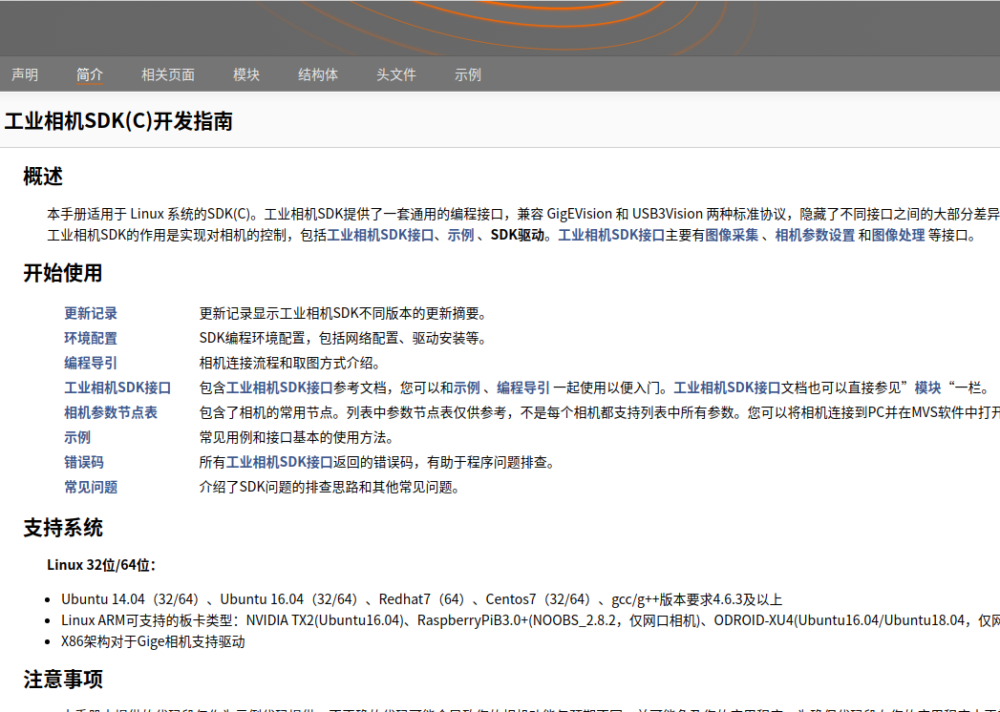

# **RM-CIDP-Vision 程序调试手册 V1.2**


## 一、相机调参

首先确定使用镜头焦距和相机采集画幅，为保证单目测距精确度，不同焦距必须使用不同参数。

> 相机：海康威视MVCA016-10UC

> 镜头品牌：沃乐斯

目前已给出以下焦距镜头的参数表，请按照实际使用焦距进行调整,
可手动进行调整。
> **调整位置位于  /armor/include/armor_finder/armor_finder.h** 

| 程序输入  | 默认画幅  | 推荐画幅  |
|---|---|---|
|  **640x480 **  |  **1440x1080 **  |  **1280x960**   |
|镜头焦距|参考参数|参考参数|
| 4mm  | 5600  | 6500 |
| 4.5mm  | 6100  | 7015 |
| 6mm  |  8240 | 9480 |
| 8mm  |  11500 | 13000 |

参考资料《关于单目测距的误差说明》


**相机参数可通过以下两种途径调试**

> 1、海康相机官方调试软件 MVS
>
> 2、程序启动【相机调参模式】


在【相机调参模式】下，拖动对应参数滑动条时自动实时保存参数。保存的参数将写入相机内部，相机下次启用时即可使用该参数组。

【注意】：每次进入【相机调参模式】会重置回程序设定的默认参数组。关于默认参数组的设置详见  others\src\camera\Hikcamera_wrapper.cpp


**环境参考：2021RoboMaster超级对抗赛北部赛区赛场**




## 二、程序启动

机器已默认设置为通电开机程序自启动，程序进程检测，断线重连。
程序可以通过不同的运行参数启用【详见启动选项】以启用不同功能。
连接好相机后，等待相机指示灯进入待运行状态【参考海康相机说明手册指示灯部分】，执行生成文件run并附上运行参数即可。

**示例：**

> **1、在项目根目录下创建可执行程序目录**
>
> ~~~shell
> mkdir build 
> ~~~
>
> **2、Cmake 构建与编译**
>
> ~~~shell
> cmake ..
> make
> ~~~
>
> **3、进入生成的可执行文件run的目录下，执行程序并附上参数【常用启动参数】**
>
> ~~~shell
> cd build
> ./run --debug-red
> ~~~

即可启动【相机调试模式-红色目标】


## 三、程序参数调整内容点

### 1、相机调试模式默认参数【适用于海康相机CA016-10UC】Hikcamera_debug.cpp

> 曝光范围、Gain增益范围、Gamma增益范围、白平衡

### 2、灯条识别类：find_light_blobs.cpp

> 旋转矩形的长宽比、轮廓面积与最小外接矩形面积之比、亮斑面积筛选、灯条颜色判断、灯条重叠滤除、亮斑获取(开闭运算)、灯条全局搜索

### 3、灯条到装甲板：find_armor_box.cpp

> 灯条角度差、灯条高度差、灯条间距、灯条长度比、灯条错位度、装甲板角度朝向

### 4、装甲板类：armor_box.cpp

> 装甲板中心点判断设置、灯条中心点间距设置、灯条长度与间距比例设置、基于三角测距的单目测距法、装甲板优先级设定

### 5、跟踪器类：armor_finder.cpp

> 跟踪时长、多目标切换最小延时、跟踪目标搜寻面积

### 6、分类器类：TrainCNN 文件夹

> 网络结构、模型训练参数调试

### 7、小工具类 ：tools 文件夹

> CameraCalibration文件夹 相机标定说明
>
> analysis.py 串口通信可视化工具
>
> auto-pull.sh 自动提交代码
>
> auto_start 程序开机自启动与进程检测
>
> save_distance.cpp 测距记录
>
> save_labelled.cpp 数据集采集

### 8、附加功能类：  additions.cpp

> 视频录制(设置保存路径、格式、帧率、尺寸等)
>
> 串口接收处理

### 9、其他设置

> 串口设置 serial.cpp
>
> 系统时钟设置 systime.cpp


### 10、常用启动参数  options.cpp

|       附加参数        |                   功能说明                   |
| :-------------------: | :------------------------------------------: |
|     --debug-blue      |              蓝色目标的相机调参              |
|      --debug-red      |              红色目标的相机调参              |
|      --match-red      |            正式比赛用（红色目标）            |
|     --match-blue      |            正式比赛用（蓝色目标）            |
| --save-labelled-boxes | 保存带有id标签的候选框，用于分类器数据集采集 |
|     --save-video      |                   视频录制                   |
|     --show-origin     |                   显示原图                   |
|      --show-info      |                   显示消息                   |

支持自定义功能，详情参考 options.cpp 仿写即可。

## 四、海康相机SDK开发与调试
参阅海康SDK配置路径下的doc文档【通常默认为 /opt/MVS/doc】



## 五、通信协议

### 1.通信方式

使用USB转TTL进行串口通信。

### 

### 2.数据接收结构体

```
struct McuData {
    float curr_yaw;      // 当前云台yaw角度
    float curr_pitch;    // 当前云台pitch角
    uint8_t state;       // 当前状态，自瞄-大符-小符
    uint8_t mark;        // 云台角度标记位
    uint8_t anti_top;    // 是否为反陀螺模式
    uint8_t enemy_color; // 敌方颜色
    int delta_x;         // 能量机关x轴补偿量
    int delta_y;         // 能量机关y轴补偿量
};
```

每个数据帧后使用字符`'\n'`作为帧尾标志。

### 

### 3.数据发送结构体

```
struct SendData {
    char start_flag;      // 帧头标志，字符's'
    int16_t yaw;          // float类型的实际角度(以度为单位)/100*(32768-1)
    int16_t pitch;        // float类型的实际角度(以度为单位)/100*(32768-1)
    uint16_t shoot_delay; // 反陀螺模式下的发射延迟
    char end_flag;        // 帧尾标识，字符'e'
};
```

实际发送代码中没有使用这个结构体，而是使用uint8_t类型数组直接赋值代替。


## 六、常见问题

**1、帧率波动或显著降低**

#### 硬件层面

> 1、采集帧率低  检查相机是否为USB3.0模式，检查线是否插牢固;检查相机采集帧率 调整相机参数。

#### 软件层面

> 1、使用系统监视器【例如 htop 】检查是否存在其他应用程序占用运算资源情况。
>
> 2、跟踪器初始化，画面中目标越大初始化耗时越长。常见于跟踪目标发生切换或识别率低下(断断续续)导致的反复初始化。
>
> 3、开闭运算，画面中目标越大处理量越大。常见于目标过近。


**2、相机无法启动**

> 1、观察相机指示灯，检查相机连接是否正常。
>
> 2、相机占用冲突：MVS未关闭相机连接，占用相机。程序无法启动。
>
> 3、相机参数组加载存在错误，参照【相机参数组加载失败】
>
> 4、海康正常BUG，可能是相关内存未能销毁。重新插拔相机或重启程序再使用


**3、相机参数组加载失败**

> 1、可能因为多次启动失败导致相机恢复初始化，重新设置参数即可【此时建议使用MVS设置】
>
> 2、查阅海康机器人官方SDK开发文档或寻求官方售后
