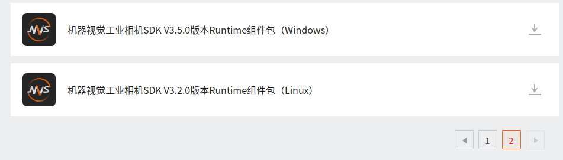

## 本项目运行需要配置以下环境

### 1、OpenVINO 加速库
 * 参阅[ OpenVINO 2021.4 Get Start](https://docs.openvino.ai/2021.4/openvino_docs_install_guides_installing_openvino_linux.html)

### 2、Eigen 矩阵运算库

~~~shell
sudo apt install libeigen3-dev
~~~

### 3、Yaml-Cpp 库
~~~shell
cd /opt && git clone https://github.com/jbeder/yaml-cpp.git
cd yaml-cpp && mkdir build && cd build && cmake -DBUILD_SHARED_LIBS=ON ..
make && sudo make install
~~~

### 4、海康威视相机运行库
官网链接：[海康机器人开发下载中心](https://www.hikrobotics.com/cn/machinevision/service/download?module=0)



下载后**根据对应平台解压对应的版本**，解压

例：`Linux x64`平台

> ```
> sudo dpkg -i 包名
> ```

它会默认自动安装到 /opt 下，如果没有报错，则海康相机库配置完成，同时也包含MVS【海康相机调试平台】

#### 注意：安装完成后如果出现.so文件找不到等环境配置问题。可手动添加环境路径：http://t.zoukankan.com/unixcs-p-13993366.html


### 5、其他常见问题收录区
[linux 串口权限问题](https://blog.csdn.net/itas109/article/details/83027431)